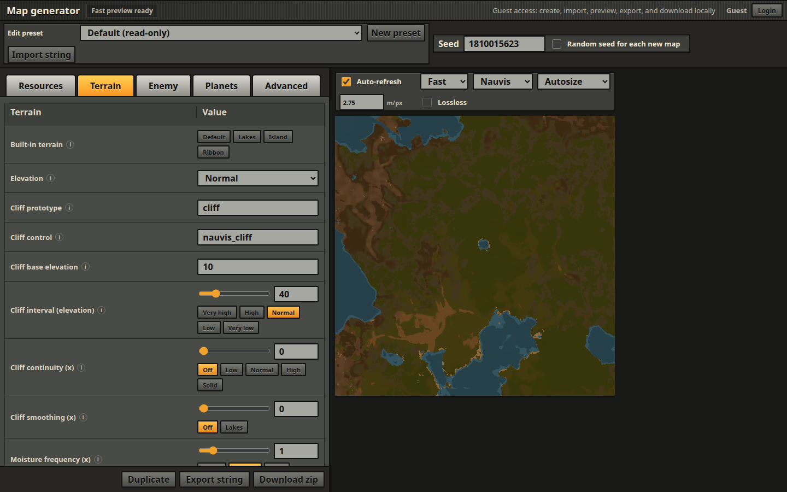

# FactMapGen

FactMapGen is a small Go web tool for creating and editing Factorio `map-gen-settings.json` and `map-settings.json` files. Map presets are stored on the server as folders; the browser edits those server-side files directly.



## Run

```sh
go run . -addr :8080 -presets presets
```

Open `http://localhost:8080`.

On the first run, FactMapGen creates an `admin` account and prints a generated password to the server log. User accounts, sessions, and audit entries are stored in `factmapgen-auth.db` by default. Use `-auth-db path/to/auth.db` to choose a different SQLite file.

The `-data` flag still works as a backwards-compatible alias for `-presets`.

## Build

```sh
go build -o factmapgen .
./factmapgen -addr :8080 -presets presets
```

## Authentication

Guests can browse presets, create or import a transient working preset, edit settings, generate previews, export exchange strings, and download ZIP files without logging in. Guest work never writes preset folders on disk. Persisting server presets by creating, importing, saving, duplicating, renaming, or deleting generators requires a logged-in user. Admin users can add, edit, and delete accounts from the Admin panel in the browser. Passwords are stored as PBKDF2-SHA256 hashes in SQLite, and sessions use HttpOnly cookies.

Preset create, import, update, duplicate, rename, and delete actions write audit log entries with the acting user, action, target, detail, and timestamp. Account changes are audited too.

## Server Files

Each preset is saved as:

```text
presets/
  Preset Name/
    map-gen-settings.json
    map-settings.json
```

The UI focuses on the visual map generator. Frequently tuned settings use sliders, toggles, selects, and named per-setting presets for world size up to 16K, terrain shape, cliffs, evolution, expansion, pollution, pathfinding pressure, and resources. New presets are created from a modal dialog so the main toolbar stays focused on editing. The built-in per-setting preset buttons are derived from Factorio's bundled `map-gen-presets.lua` and `autoplace-controls.lua` data where those values can be represented directly. Space Age-only autoplace controls are kept in a separate Space Age tab by planet, based on the installed `space-age/prototypes/autoplace-controls.lua` and planet map-gen data. Keys not exposed visually are preserved when saving, as long as the preset already contains them.

In `map-gen-settings.json`, `seed: null` follows Factorio's public example file and is the default. It tells Factorio to choose a unique randomized map seed each time a new map is generated. The editor also treats older `seed: 0` presets as random. Use a positive seed value only when you want repeatable generation.

## Map Previews

FactMapGen includes a fast built-in Go preview renderer for Nauvis-style maps. Its default Nauvis terrain path ports Factorio-compatible seeded noise, elevation, climate fields, and all 21 terrain-tile probability expressions; entity and resource overlays remain approximate. The preview toolbar also offers an Exact engine that generates real Factorio map preview PNGs when a Factorio/headless binary is available. Install the Linux headless package into the default discovery path with:

```sh
./scripts/install-factorio-headless.sh
```

Then restart FactMapGen:

```sh
go run . -addr :8080 -presets presets
```

The server auto-discovers `tools/factorio/bin/x64/factorio`. You can also point at another install:

```sh
go run . -factorio-bin /opt/factorio/bin/x64/factorio
```

The main web page shows the detected Factorio binary version and flags when the latest stable headless release is newer. Version and latest-release checks are cached by the server. Admin users can refresh Factorio status from the Admin panel and, when the active binary comes from `-factorio-dir`, delete that managed install and install a fresh stable headless copy. The fast renderer supports Nauvis-style maps, including the Lakes and Island elevation options. The Exact engine's preview surface selector offers the known Factorio planets: Nauvis plus the Space Age planets Vulcanus, Gleba, Fulgora, and Aquilo.

Preview scale is an arbitrary numeric value in meters per output pixel from `0.015625` through `64`, subject to the Exact engine's 16,384-pixel source-render limit. Values above `1` show more map area and values below `1` zoom into whole map tiles. Legacy API values such as `out-4` and `in-3` remain accepted.

Exact Factorio preview generation is queued server-side so only one Factorio process runs at a time. The queue defaults to 8 waiting jobs and can be changed with `-preview-queue`. Each exact render is capped at 60 seconds by default and can be changed with `-preview-timeout`. Admin preview jobs are served before regular signed-in users, and signed-in users are served before guests; jobs with the same priority run in request order. If the queue is full, the exact preview request returns HTTP 429.

Generated preview images are transient. The server converts preview images to AVIF with JPEG fallback unless `lossless` is requested, and the browser receives a short-lived `/api/previews/...` URL. Exact Factorio previews start from Factorio's temporary PNG output and then apply the requested zoom transform. Preview images are kept in memory for up to 30 minutes with a 100-image cap, and are not cached per preset. On startup, when exact previews are configured, the server warms a pinned 512px Nauvis preview for the built-in Default preset so first page load can show an immediate exact image without waiting for autosize rendering.

Preview parity tests compare rendered PNG pixels and write visual artifacts. The fast terrain integration cases disable resources, trees, rocks, enemies, cliffs, and decorations so terrain correctness is measured independently from approximate overlays:

```sh
FACTMAPGEN_FACTORIO_BIN=/opt/factorio/bin/x64/factorio go test -run TestExactPreviewMatchesDirectFactorioPreview
FACTMAPGEN_FACTORIO_BIN=/opt/factorio/bin/x64/factorio FACTMAPGEN_FAST_PREVIEW_PARITY=1 go test -run TestFastPreviewMatchesFactorioPreview
FACTMAPGEN_FACTORIO_BIN=/opt/factorio/bin/x64/factorio FACTMAPGEN_PREVIEW_GALLERY=1 go test -run TestPreviewGalleryDefaultSeeds -v
```

Diff artifacts are written to `test-output/preview-diffs/` as `factorio.png`, `actual.png`, `diff.png`, and `stats.json`. The exact-engine parity test runs automatically when a Factorio binary is discoverable. The fast terrain test is opt-in and enforces broad tile-color and water-mask correctness budgets rather than requiring exact pixels.

The gallery test writes `test-output/preview-gallery/default-10-seeds-terrain/index.html`, with resource-free Factorio terrain, fast Go terrain, and amplified diff images for ten reproducible pseudo-random default-preset seeds. Existing dimension-compatible Factorio PNGs are reused; subsequent runs regenerate only fast images, diffs, statistics, and HTML.

## Presets

Built-in presets:

- `default`
- `no-biters`
- `rail-world`
- `death-world`
- `rich-resources`
- `marathon`
- `death-world-marathon`
- `peaceful-rich`
- `lakes`
- `island`
- `ribbon-world`
- `empty-sandbox`
- `marathon-frontier`
- `dense-forest`
- `desert-scarcity`
- `cliffside-lakes`
- `oil-baron`
- `tiny-death-spiral`
- `megabase-plain`
- `waterworld`
- `forest-deathworld`
- `ore-patchwork`
- `archipelago`
- `fragmented-coast`
- `hive-expansion`
- `sparse-rich-desert`
- `island-escape`

The bundled default templates are based on Wube's public `factorio-data` example JSON files. `map-gen-settings.example.json` keeps the public random seed form, `seed: null`.

## API

- `GET /api/config`
- `GET /api/session`
- `POST /api/session` with `{ "username": "admin", "password": "..." }`
- `DELETE /api/session`
- `PUT /api/session/password` with `{ "currentPassword": "...", "newPassword": "..." }`; login required
- `GET /api/users` admin only
- `POST /api/users` admin only, with `{ "username": "...", "password": "...", "isAdmin": true }`
- `PUT /api/users/{id}` admin only
- `DELETE /api/users/{id}` admin only
- `GET /api/audit?limit=200` admin only
- `GET /api/factorio` admin only; returns cached Factorio binary, version, latest stable release, and install status
- `POST /api/factorio/install` admin only; deletes and reinstalls the managed `-factorio-dir` headless install
- `GET /api/profiles`; public
- `POST /api/profiles` with `{ "name": "...", "preset": "default" }`; login required
- `POST /api/profiles/import-exchange` with `{ "name": "...", "exchangeString": ">>><<<" }`; guests receive a transient `local:` document; logged-in users create a server preset
- `GET /api/profiles/{name}`; public
- `PUT /api/profiles/{name}` with `{ "mapGen": {...}, "mapSettings": {...} }`; login required
- `DELETE /api/profiles/{name}`; login required
- `POST /api/profiles/{name}/rename` with `{ "name": "new name" }`; login required
- `POST /api/profiles/{name}/duplicate` with `{ "name": "copy name" }`; login required
- `GET /api/profiles/{name}/download.zip`; public
- `POST /api/profiles/{name}/preview` with `{ "engine": "fast", "size": 768, "planet": "nauvis", "zoom": "2.75", "lossless": false, "mapGen": {...} }`; public; `engine` may be `fast` for the built-in Go renderer or `factorio` for the exact Factorio renderer; omitted `engine` preserves the old exact renderer when Factorio is configured and otherwise falls back to fast; exact Factorio jobs are queued; guests are capped at 512 pixels and normal scale for Exact renders, while Fast renders accept arbitrary scale; `lossless` is signed-in only; `zoom` is a numeric meters-per-pixel string from `0.015625` through `64`, with legacy `out-N` and `in-N` values accepted; `mapGen` is optional and lets the server preview unsaved edits from a temporary file
- `GET /api/previews/{token}.avif`, `.jpg`, or `.png`; public, short-lived preview image returned by a preview request

Profile names may contain letters, numbers, spaces, dots, underscores, and hyphens.
